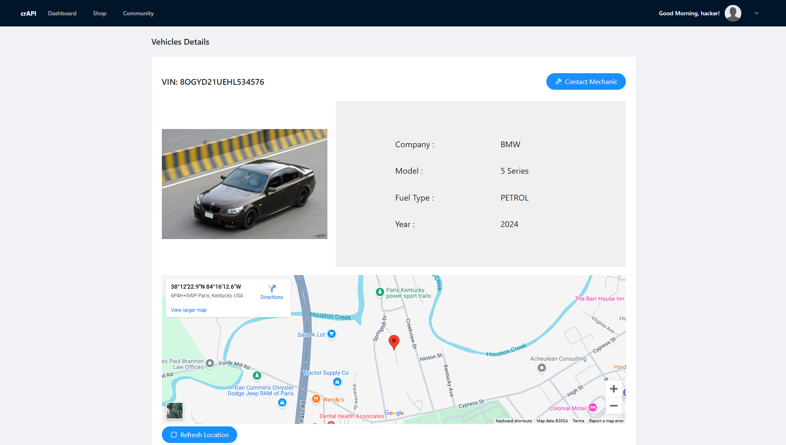
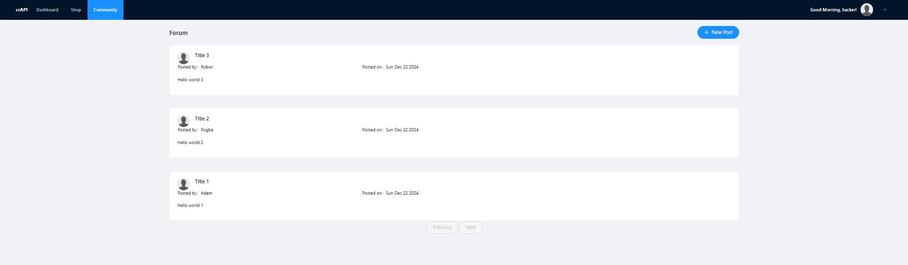
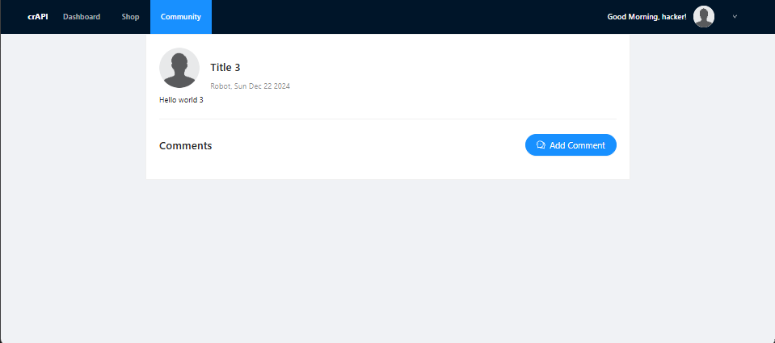
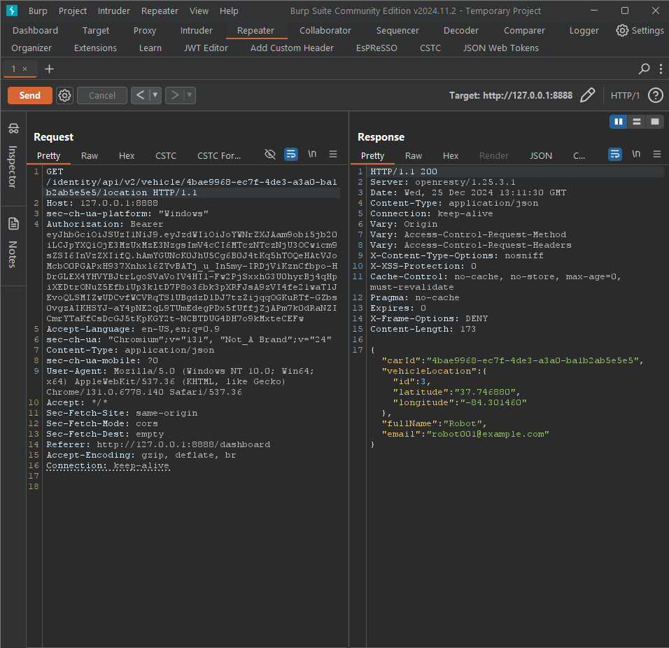

# API Testing Documentary

This documentation illustrates the testing process for API vulnerabilities, particularly focusing on **Broken Object Level Authorization (BOLA)**. It highlights the testing tools, techniques, and findings.

---

## Overview

API security is critical for modern web applications. This project demonstrates the identification and exploitation of a **BOLA vulnerability**, allowing unauthorized access to sensitive information.

### Tools Used:
- **Burp Suite (Community Edition)**: For intercepting and analyzing HTTP requests and responses.
- **Postman**: For testing API endpoints and verifying responses.

---

## Features Tested

1. **Vehicle Details Endpoint**
   - Retrieves vehicle information:
     - Brand
     - Model
     - Year
     - Location displayed on an interactive map.

2. **User Details Endpoint**
   - Lists user details and roles.
   - Explored token-based access vulnerabilities.

3. **Interactive Map**
   - Integrated to show vehicle locations dynamically.

---

## Visual Demonstration

### Application Interface
1. **Vehicle Details Page**  
    
   Displays vehicle information and maps integration.

2. **User Data List**  
     
   Lists usernames, roles, and other details exposed due to inadequate access control.

### Testing Analysis
3. **Burp Suite Testing**  
     
   Demonstrates request-response interception and token manipulation.

4. **Vulnerability Exploitation**  
   ![alt text]./Assets/(image-4.png) 
   Shows the process of sending unauthorized requests using modified tokens.

5. **Request and Response Flow**  
     
   Highlights weak API endpoints exploited to retrieve sensitive data.

---

## Observations

- **Vulnerability Identified:** 
  - Weak object-level authorization allows unauthorized data access.
- **Impact:** 
  - Exposure of sensitive user and vehicle data to attackers.

---

## Recommendations

1. **Access Control Improvements:**
   - Implement strict role-based access controls (RBAC) for all endpoints.

2. **Secure Token Management:**
   - Validate token ownership for every request.
   - Use short-lived tokens with regular rotation.

3. **Input Validation:**
   - Sanitize and validate all user inputs before processing.

4. **Logging and Monitoring:**
   - Implement API usage logs and real-time monitoring to detect unauthorized activity.

---

## Disclaimer

This documentation is created for **educational and research purposes only**. Always conduct security testing responsibly in authorized environments.

---
