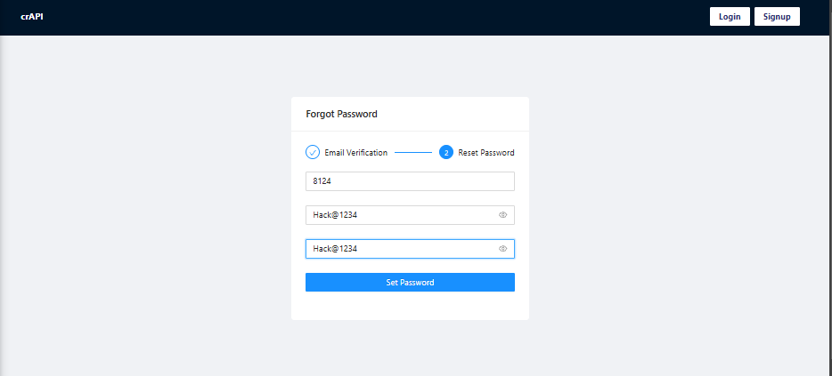

# API Testing Documentary

## Introduction
Welcome to the "API Testing Documentary"—a step-by-step exploration of security testing techniques, focusing on OTP brute force attacks. This guide will walk you through an engaging process of identifying vulnerabilities and exploiting them responsibly to improve system security.

---

## Table of Contents
1. [Overview](#overview)
2. [How It Works](#how-it-works)
   - [Setting the Stage](#setting-the-stage)
   - [Sending Payloads](#sending-payloads)
   - [Executing the Attack](#executing-the-attack)
   - [Post-Attack Analysis](#post-attack-analysis)
3. [Tools of the Trade](#tools-of-the-trade)
4. [Key Insights](#key-insights)
5. [Recommendations](#recommendations)

---

## Overview
This document showcases the use of a brute force attack on an OTP authentication system. The scenario begins with not knowing the password but leveraging tools to crack the OTP and eventually gain access to change the password.

---

## How It Works

### Setting the Stage
- **Objective**: Exploit OTP-based authentication through brute force.
- The interface prompts for an OTP and password. The attack begins with inserting random OTPs and passwords to test server response.

---

### Sending Payloads
- Use tools like Burp Suite to send crafted requests to the server.
- Configure the Intruder module to automate payload insertion for brute force.

---

### Executing the Attack
- Begin the attack by launching the payloads.
- Monitor the server's responses for discrepancies, such as changes in content length (e.g., 507 to 488), which indicate success.

---

### Post-Attack Analysis
- Once the attack succeeds, verify the password change by logging in with the new credentials.

---

## Tools of the Trade
- **Burp Suite**: To intercept requests, manage payloads, and automate brute force attacks.
- **Browser Developer Tools**: To inspect and debug network requests.

---

## Key Insights
1. Server response content length differences serve as an indicator of successful exploitation.
2. OTP systems without rate-limiting mechanisms are highly vulnerable to brute force attacks.
3. Testing and securing APIs is crucial to safeguarding user data.

---

## Recommendations
To prevent vulnerabilities like the one demonstrated:
- **Rate Limiting**: Implement rate-limiting to block excessive OTP attempts.
- **Account Lockout**: Lock accounts temporarily after multiple failed OTP attempts.
- **Stronger Validation**: Use multi-factor authentication and secure OTP generation.
- **Regular Security Audits**: Test APIs regularly to ensure robustness against emerging threats.

---

## Conclusion
This documentary highlights the importance of proactive security testing. By understanding how attackers exploit vulnerabilities, developers can build systems that are more resilient and secure. Let this serve as both a warning and a guide to strengthening your API defenses.
