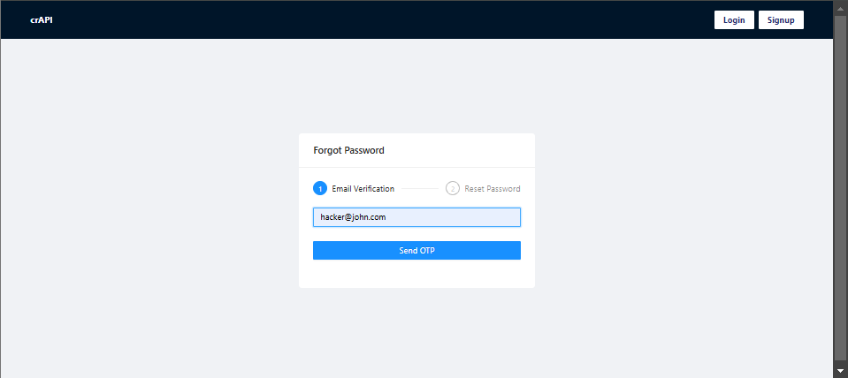
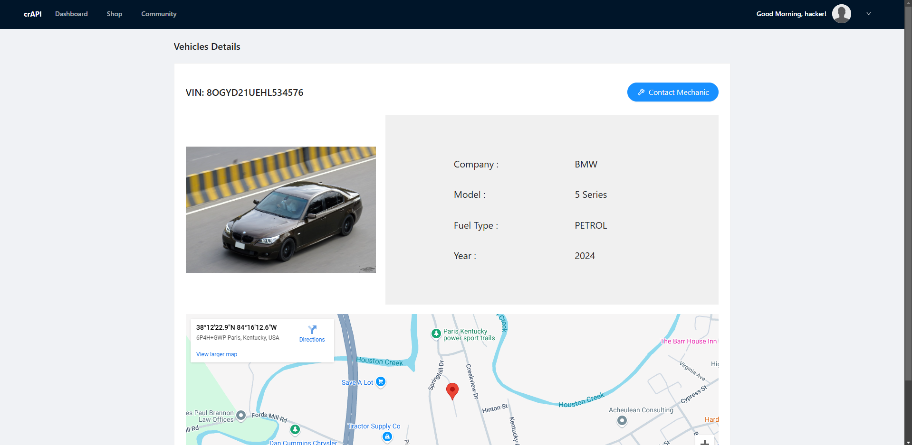

# API-Testing-Documentary

when we don't we don't know the password and we will hack it through otp brutforce attack

add random otp and password 

send this to intruder

start intuder 
when we the length from 507 to 488

so after that password is changed 

