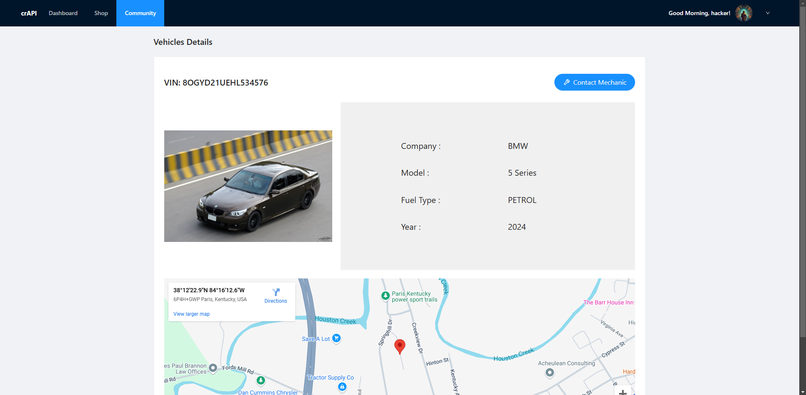
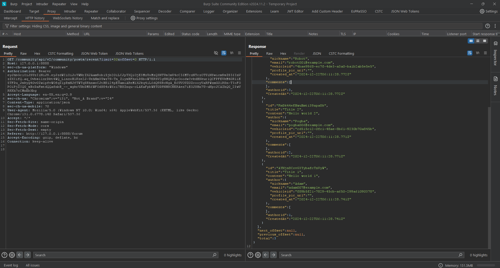

# API-Testing-Documentary

This repository documents API testing processes, focusing on identifying and analyzing vulnerabilities such as **Excessive Data Exposure**. The project demonstrates how API endpoints can inadvertently reveal sensitive information through improper data handling.

## Overview

### Key Features Documented:
- **Vehicle Details Page:** Displays sensitive information like VIN, company, model, and fuel type. Includes geolocation details on a map.
- **Forums Section:** Showcases user interactions, comments, and timestamps.
- **Detailed View:** Displays specific user data, which may be susceptible to data exposure.

## Screenshots

### Vehicle Details


The vehicle details page demonstrates how APIs can expose sensitive data, such as:
- Vehicle Identification Number (VIN)
- Location data (via map integration)
- Model year and fuel type

### Forums Section


The forums section displays:
- User comments and posts
- Timestamps associated with activities

### Detailed User Data


This page includes:
- User profiles
- Associated comments and actions

### API Debugging Console



The API debugging console showcases:
- API requests and responses
- Response headers and payloads
- JSON structure revealing sensitive data fields

## Vulnerabilities Explored

### Excessive Data Exposure
**Excessive Data Exposure** occurs when APIs provide more information than necessary. Key takeaways from this documentary:
- Always limit API responses to include only essential fields.
- Avoid exposing sensitive information like VIN, user emails, or detailed timestamps unless required.
- Use proper access control mechanisms to restrict data visibility.

### Key Recommendations:
1. **Field Filtering:** Ensure APIs only return necessary data for the intended purpose.
2. **Authentication:** Secure endpoints with proper authentication and authorization protocols.
3. **Rate Limiting:** Prevent abuse by implementing rate limits.
4. **Logging and Monitoring:** Continuously log and monitor API activities for anomalies.

## Getting Started

### Prerequisites
To replicate and test the documented scenarios, you'll need:
- A REST API testing tool like **Postman** or **cURL**
- Browser developer tools (e.g., Chrome DevTools)

### Steps:
1. Clone this repository:
   ```bash
   git clone <repository-url>
   ```
2. Open the included images and review the documented vulnerabilities.
3. Analyze the JSON responses for sensitive data exposure.
4. Implement the recommended security measures in your own APIs.

## Contributions
Contributions are welcome! If you want to add more API vulnerabilities or improve this documentary, feel free to fork the repo and submit a pull request.