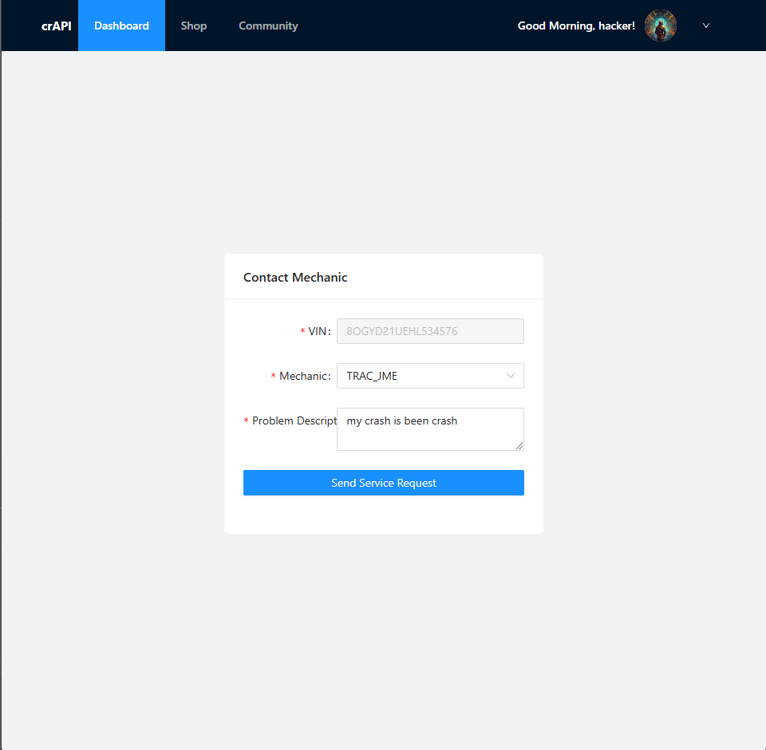
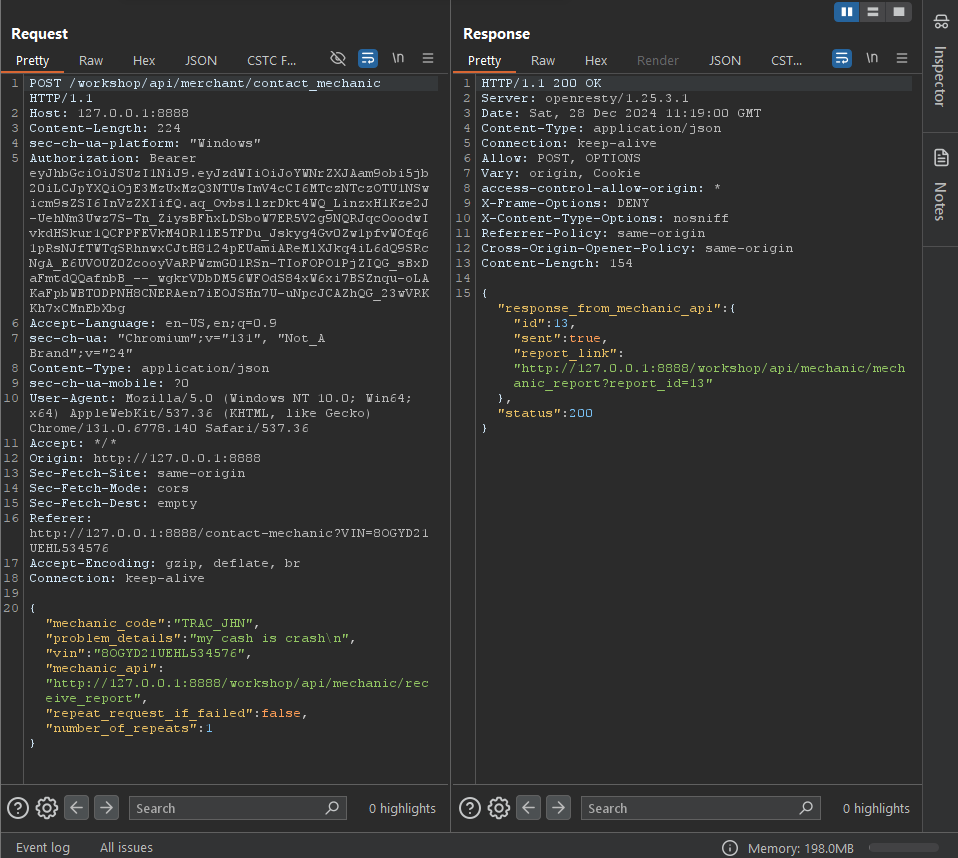
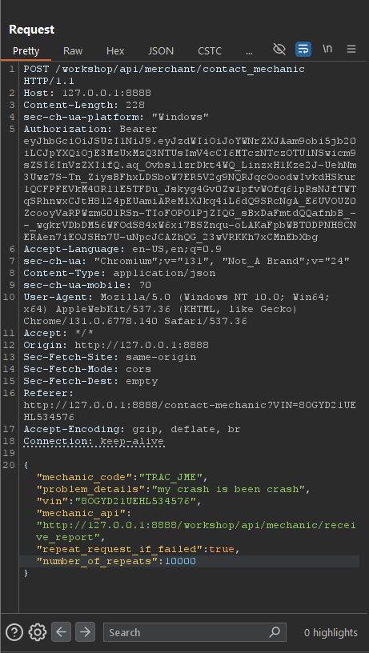
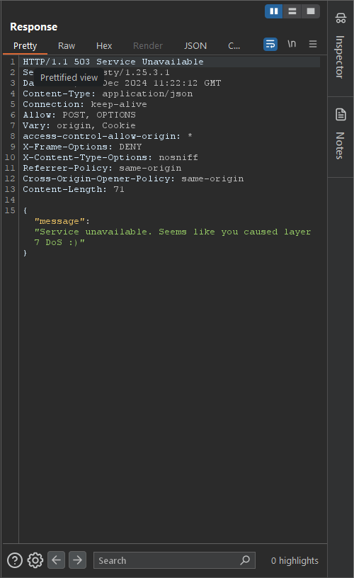

# API-Testing-Documentary






# API-Testing-Documentary


This repository documents API testing processes, focusing on identifying and analyzing vulnerabilities such as **Rate Limiting and Lack of Resources** in the crAPI platform. The project demonstrates how improper resource handling can lead to API abuse and denial of service.

## Overview


### Key Features Documented:
- **Contact Mechanic Form:** Demonstrates how lack of rate limiting can allow repeated requests, leading to potential abuse.
- **Request and Response Logging:** Details API requests and responses for debugging and testing purposes.

## Screenshots

### Contact Mechanic Form


This page demonstrates:
- A form for contacting mechanics with fields for VIN, mechanic name, and problem description.
- Potential issues when rate limiting is not enforced, allowing form submissions to be abused.

### API Request and Response Debugging


These screenshots highlight:
- API request headers and payloads.
- Response payloads showing the JSON structure and potential issues with error handling.

### Rate Limiting Scenario


This screenshot demonstrates how repeated requests to the API can overload the server when rate limiting mechanisms are not implemented.

## Vulnerabilities Explored


### API4 - Lack of Resources & Rate Limiting
**Lack of Resources & Rate Limiting** vulnerabilities occur when APIs fail to restrict the frequency of requests, leading to server overload or abuse. Key takeaways:
- Rate limiting is essential to protect server resources and prevent denial-of-service attacks.
- APIs should monitor and restrict repeated requests from the same user or IP.

### Key Recommendations:
1. **Rate Limiting:** Implement rate limits using headers like `X-RateLimit-Limit` and `Retry-After`.
2. **Error Responses:** Provide clear error messages when rate limits are exceeded.
3. **Throttling Mechanisms:** Add throttling to prevent abuse while maintaining server stability.
4. **Logging and Monitoring:** Continuously monitor API requests to identify abuse patterns.


## Getting Started

### Prerequisites
To replicate and test the documented scenarios, you'll need:
- **Burp Suite** for API testing and debugging.
- A REST API testing tool like **Postman** or **cURL**.

### Steps:
1. Clone this repository:
   ```bash
   git clone <repository-url>
   ```
2. Use Burp Suite to test API endpoints and analyze rate-limiting issues.
3. Review the provided screenshots and analyze the API request/response cycles.
4. Implement the recommended rate-limiting strategies in your own APIs.

## Contributions
Contributions are welcome! If you want to add more API vulnerabilities or improve this documentary, feel free to fork the repo and submit a pull request.

