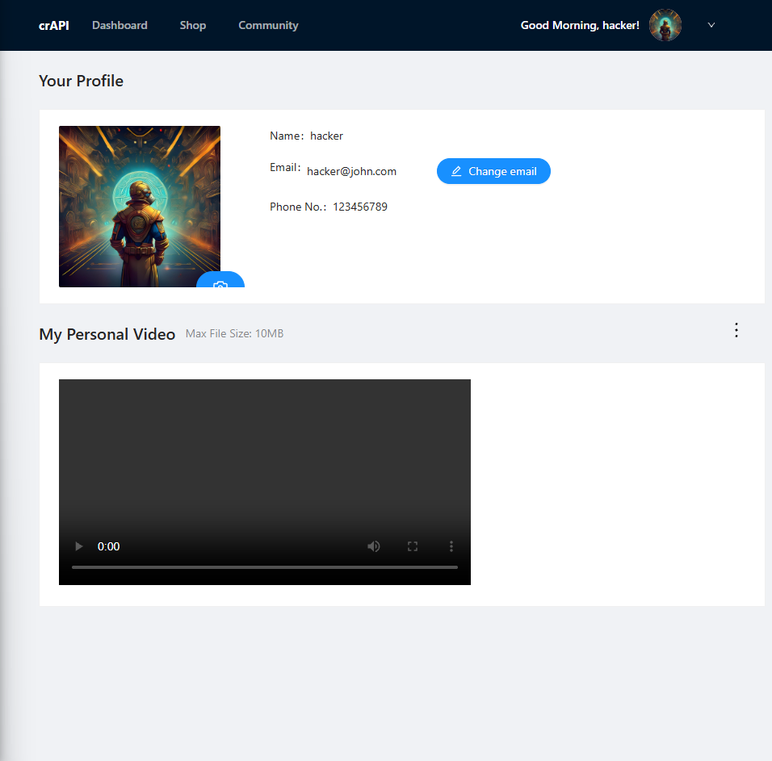
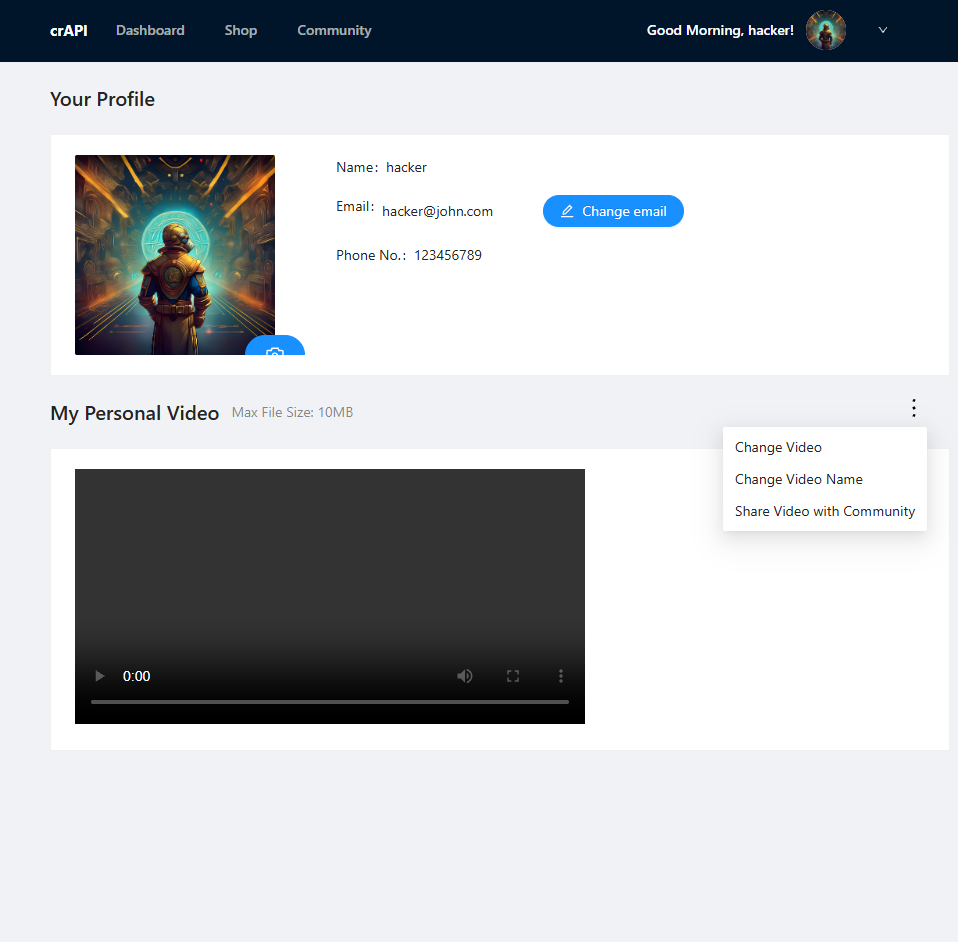
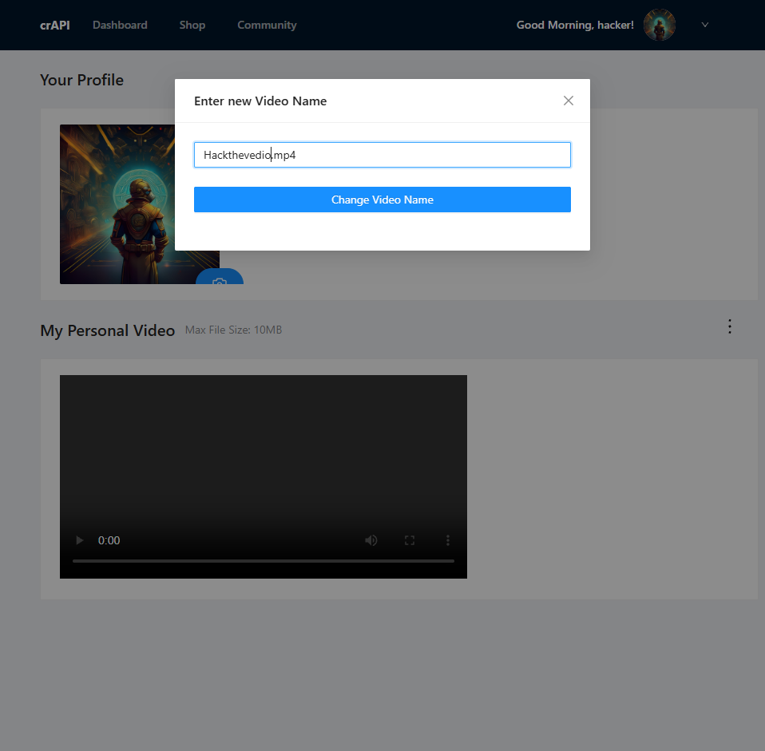
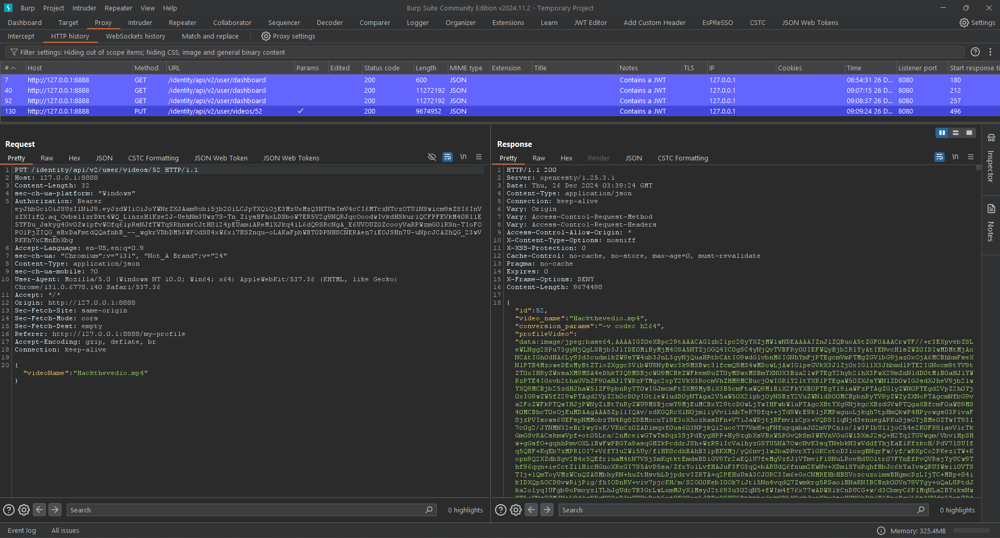
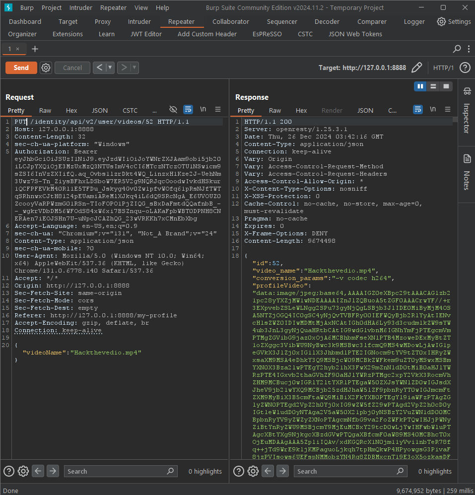
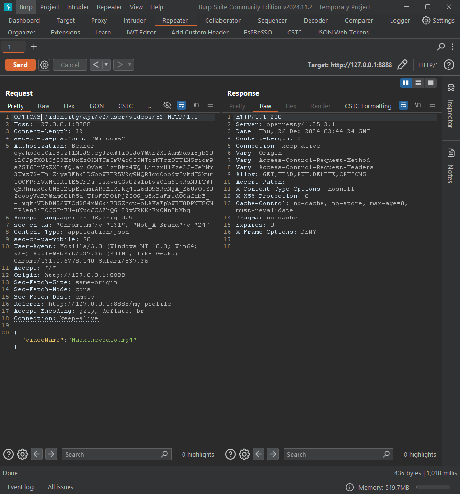
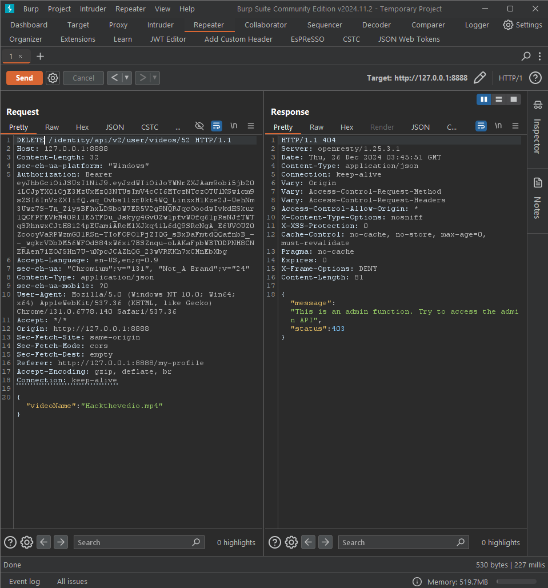
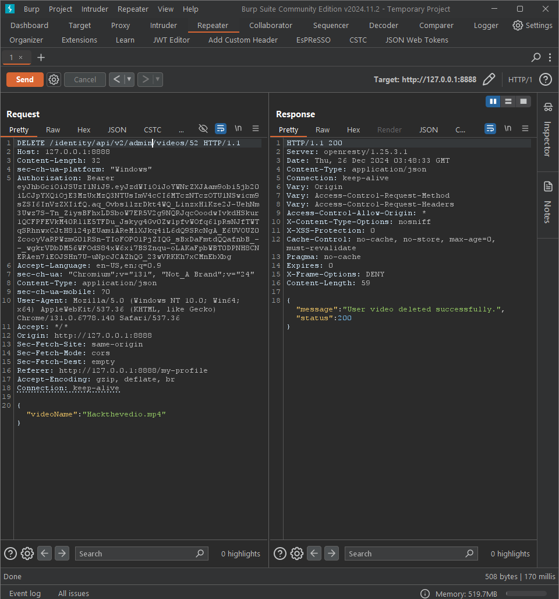
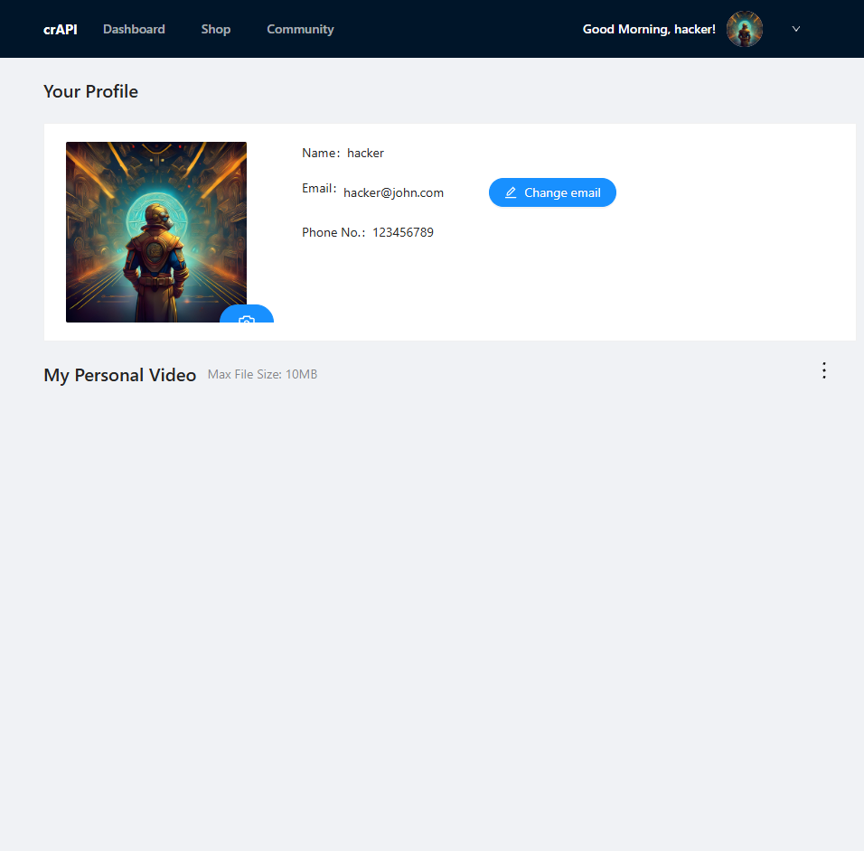

# API-Testing-Documentary

This document demonstrates testing and exploring the functionality of an API for managing user videos, with a focus on profile video upload, modification, sharing, and deletion.

---

## Features Overview

### **Video Management**
- Users can:
  - Upload a video to their profile.
  - Change the video's name.
  - Share the video with the community.
  
- **Limitations**:
  - Videos cannot be deleted by regular users and require admin privileges for deletion.

---

## Testing Process

### Upload a Video
A user can upload a video to their profile, as shown below:

### Modify Video Name and Share
Users have the ability to change the video name or share the video with the community.

### Video Deletion Limitations
Videos cannot be deleted directly by users due to restrictions in permissions.

---

## Using Burp Suite for API Testing

### Step 1: Change Video Name
Using **Burp Suite**, modify the video name via a PUT request:

### Step 2: Send Request to Repeater
Forward the request to Burp Suite's Repeater tab for further testing:

  

---

## Exploring Allowed HTTP Methods

### Step 3: Change to OPTIONS Request
Change the PUT request to an **OPTIONS** request to identify the allowed HTTP methods:

**Result**: The server supports the following methods:
- `GET`
- `HEAD`
- `PUT`
- `DELETE`
- `OPTIONS`

---

## Attempting to Delete the Video

### Step 4: Modify OPTIONS to DELETE
Change the request type to **DELETE** to attempt video deletion:

**Result**: Deletion fails as only admins are authorized to delete videos.

---

## Privilege Escalation Attempt

### Step 5: Change User Role to Admin
To bypass the restriction, attempt privilege escalation by modifying the user role to "admin":

  

**Outcome**: This action may lead to unauthorized video deletion if the server does not properly validate roles. The test demonstrates the importance of robust security practices on the server.

---

## Conclusion
This API testing revealed critical security considerations:
- Regular users are prevented from deleting videos, maintaining data integrity.
- Role-based access control (RBAC) needs to be validated server-side to avoid privilege escalation vulnerabilities.

---

