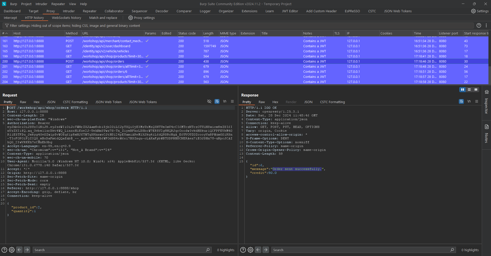
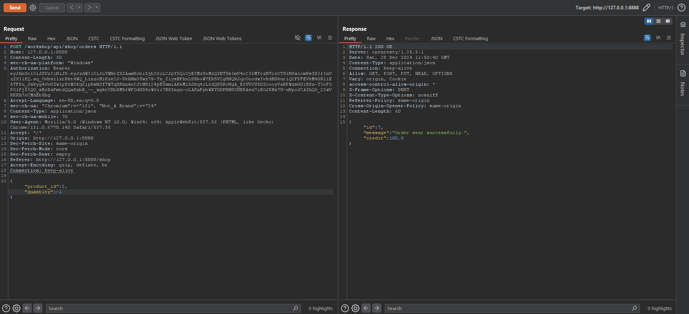
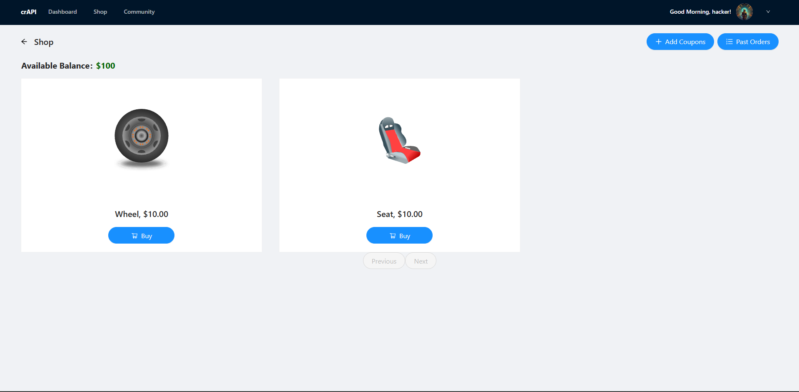
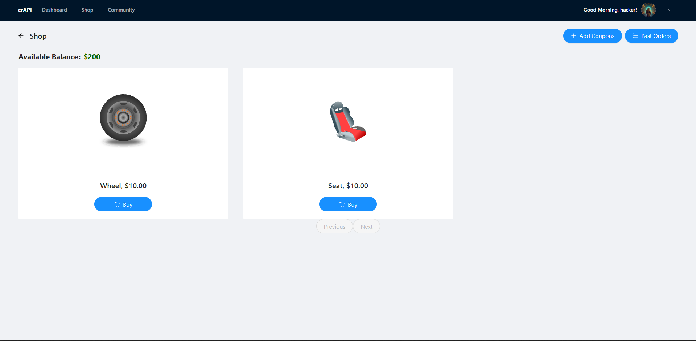
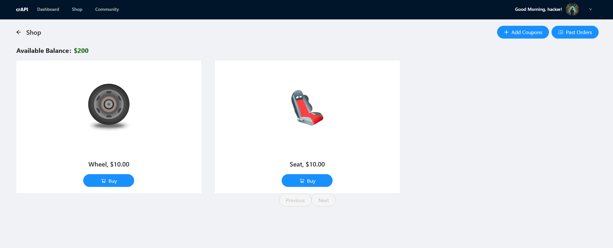
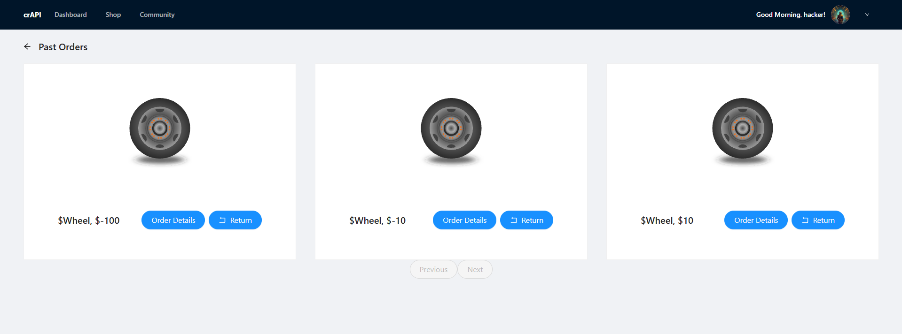

# API Testing Documentary

This documentation highlights the testing process for identifying vulnerabilities in an API, focusing on **Mass Assignment** and **API6 vulnerabilities** in crAPI. The following demonstrates the tools, techniques, and results of testing.

---

## Overview

APIs are a crucial part of modern applications but are often prone to misconfigurations and vulnerabilities. This documentation showcases the exploitation of **Mass Assignment** vulnerabilities and improper authorization handling in API testing.

---

## Tools Used

- **Burp Suite (Community Edition)**: To intercept and manipulate HTTP requests and analyze responses.
- **Repeater**: For testing and modifying API request parameters.
- **crAPI**: A test environment designed to simulate real-world API vulnerabilities.

---

## Features Tested

1. **Shop Module**:
   - **Available Balance**: Shows the user's current credits.
   - **Products**: 
     - Wheel: $10.00
     - Seat: $10.00

2. **Purchase Flow**:
   - Captured the "buy seat" API request and sent it to the repeater for further testing.

---

## Testing Analysis

### Initial Shop View

- **Balance Before Purchase**: $100
- **Purchase Action**: Buying a seat for $10 reduces the balance to $90.

---

### Manipulating Requests

1. **Modifying Purchase Value**:
   - By changing the API request parameters, such as altering the value from `1` to `-1`, the balance increases instead of decreasing.

   

2. **Incrementing Value**:
   - Adding arbitrary values (e.g., +10) through the request directly alters the user's balance.

   

---

### Post Manipulation Results

1. **Balance After Exploitation**:
   - The balance reverts to $100 or increases further based on manipulation.

   

2. **Shop View**:
   - Items and credits appear consistent, but the underlying manipulation is reflected in the system's credit calculations.

   

3. **Past Orders**:
   - The order history reflects manipulated transactions, such as multiple items being purchased with incorrect credits.

   
   

---

## Vulnerability Explored: API6 - Mass Assignment in crAPI

### Description

Mass Assignment vulnerabilities occur when an attacker adds extra parameters to an API request, which the backend blindly accepts and processes. This can lead to unauthorized data changes or privilege escalation.

---

### Example Exploitation

1. **Capture Request**:
   - Intercept a crAPI request (e.g., user profile update or purchase).

2. **Inject Additional Fields**:
   - Modify the payload by adding fields like:
     - `isAdmin: true`
     - `balance: 10000`

3. **Send Modified Request**:
   - Observe the backend accepting and updating unintended fields.

---

### Observations

1. **Exploitation Results**:
   - Users gain unauthorized privileges (e.g., admin access).
   - Credits or balances increase without valid transactions.

2. **Impact**:
   - Significant security risk, enabling attackers to manipulate user roles or financial data.

---

## Recommendations

1. **Server-Side Validation**:
   - Ensure all incoming payloads are validated against a strict schema.

2. **Field Allow-Listing**:
   - Only process pre-approved fields in API requests.

3. **Input Validation**:
   - Reject unexpected or extra fields in API payloads.

4. **Access Control**:
   - Enforce strict role-based access control (RBAC) for critical endpoints.

5. **Logging and Monitoring**:
   - Log all API interactions and monitor unusual activities to detect potential exploitation attempts.

---

## Disclaimer

This documentation is for **educational and ethical hacking purposes only**. Always test APIs in authorized environments and obtain permissions before conducting vulnerability assessments.

---
